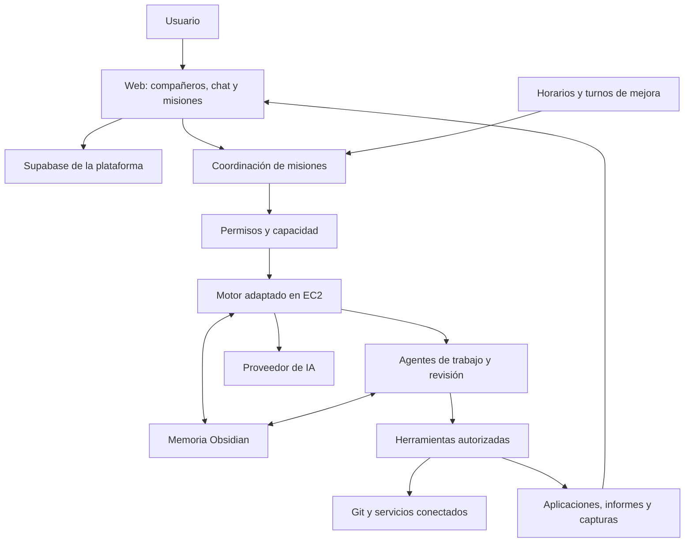

# Compañeros digitales

## Visión, decisiones y plan de construcción

Versión de trabajo · 30 de septiembre de 2026

**La idea:** una web en la que una persona habla con compañeros digitales que la conocen, organizan sus misiones y trabajan por su cuenta para producir resultados útiles. El usuario puede orientar, pausar, corregir y aprobar el trabajo sin tener que dirigir cada paso.

Este documento reúne lo decidido en el brainstorming y lo ordena para diseñar y construir el proyecto. La primera versión tendrá un alcance amplio y la usará Juanma. La estructura de usuarios en Supabase se prepara desde el principio. Se adaptará un motor existente; Pi es el candidato propuesto, todavía pendiente de evaluación frente a alternativas.

### Estado de las decisiones

| Marca | Significado |
| --- | --- |
| **Decidido** | Juanma lo ha confirmado. Es una condición del producto. |
| **Propuesta** | Organización o solución sugerida para hacer el proyecto concreto. Puede ajustarse. |
| **Pendiente** | Falta una decisión o comprobar el encaje real. |
| **Pospuesto** | Se ha excluido expresamente de esta fase. |

Una ilustración, un nombre de estado o un ejemplo de interfaz no constituye una nueva decisión. Tampoco una fuente documental demuestra que hayamos instalado o probado una integración.

### Documentos que se complementan

- [Resumen visual](resumen.html): mapa de la idea y demostración conceptual del recorrido de una misión.
- [Preguntas y respuestas](decisiones.md): registro íntegro del brainstorming, con las 60 preguntas, las decisiones previas y las ocho aclaraciones adicionales.
- Este documento: especificación de producto y propuesta de orden de desarrollo.

### Índice

1. [Qué queremos conseguir](#1-qué-queremos-conseguir)
2. [Las piezas del producto](#2-las-piezas-del-producto)
3. [Alcance inicial](#3-alcance-inicial)
4. [Primer uso y regreso](#4-primer-uso-y-regreso)
5. [Identidad y relación](#5-identidad-y-relación)
6. [Cómo se crea y organiza una misión](#6-cómo-se-crea-y-organiza-una-misión)
7. [Fechas, avances y cierre](#7-fechas-avances-y-cierre)
8. [Autonomía, dudas y permisos](#8-autonomía-dudas-y-permisos)
9. [Memoria persistente](#9-memoria-persistente)
10. [Agentes internos y mejora mutua](#10-agentes-internos-y-mejora-mutua)
11. [Ritmo de trabajo](#11-ritmo-de-trabajo)
12. [Qué se entrega](#12-qué-se-entrega)
13. [Servicios y versiones](#13-servicios-y-versiones)
14. [Suscripción y capacidad](#14-suscripción-y-capacidad)
15. [Notificaciones](#15-notificaciones)
16. [Propuesta de pantallas](#16-propuesta-de-pantallas)
17. [Propuesta de estructura para desarrollo](#17-propuesta-de-estructura-para-desarrollo)
18. [Cómo mantener sencillo el desarrollo](#18-cómo-mantener-sencillo-el-desarrollo)
19. [Plan de construcción](#19-plan-de-construcción)
20. [Recorridos para comprobar el producto](#20-recorridos-para-comprobar-el-producto)
21. [Decisiones pendientes](#21-decisiones-pendientes)
22. [Correspondencia con el brainstorming](#22-correspondencia-con-el-brainstorming)
23. [Referencias y límites de lo comprobado](#23-referencias-y-límites-de-lo-comprobado)

## 1. Qué queremos conseguir

### 1.1. Promesa del producto — Decidido

El compañero transforma una petición en trabajo y en una entrega. Conoce progresivamente al usuario, conserva el contexto de sus misiones y aprende de las correcciones. Debe ser pragmático, útil y capaz de cuestionar una petición cuando crea que una alternativa ayudaría más.

La señal de éxito es que el usuario pueda dejarlo trabajar sin estar constantemente encima de él. Su autonomía se ejerce dentro de los permisos, la capacidad y los presupuestos disponibles.

### 1.2. Tres historias principales — Decidido

| Historia | Petición de ejemplo | Resultado esperado |
| --- | --- | --- |
| **Crear** | «Ayúdame a crear mi negocio o aplicación online». | Una aplicación utilizable, con versiones visibles durante el trabajo. |
| **Investigar** | «Investiga esta idea y ayúdame a entenderla». | Un informe HTML visual, adaptado a una plantilla elegida. |
| **Vigilar** | «Mantente atento a estas novedades». | Revisiones programadas y avisos relevantes según la misión. |

Los ejemplos ayudan a empezar. El usuario también puede escribir libremente y pedir otro tipo de trabajo.

### 1.3. Sencillez — Decidido como dirección general

La persona ve al compañero, sus misiones, sus resultados y las decisiones que requieren su atención. Las subtareas se consultan en una vista secundaria. La complejidad de los agentes internos y de las herramientas debe explicarse solo cuando resulte útil.

**Propuesta de diseño:** usar pocas acciones principales y mantener los detalles accesibles: hablar, ver la entrega, pausar, cambiar el objetivo y aprobar una acción concreta. La apariencia exacta de estos controles todavía puede ajustarse.

## 2. Las piezas del producto

| Pieza | Significado | Estado |
| --- | --- | --- |
| Usuario | Persona que tiene compañeros, preferencias y misiones. | Decidido. |
| Compañero | Identidad enfocada a un aspecto de la vida del usuario. Puede tener varias misiones. | Decidido. |
| Misión | Objetivo con conversación y contexto propios. | Decidido. |
| Etapa | Un avance o entrega dentro de una misión. | Decidido como concepto; validación intermedia pendiente. |
| Subtarea | Trabajo interno que se puede consultar en detalle. | Decidido. |
| Agente interno | Especialista invocado por el compañero para realizar o revisar trabajo. | Decidido como capacidad; organización concreta pendiente. |
| Entrega | Aplicación, documento, archivo o evidencia de avance. | Decidido. |
| Propuesta de mejora | Idea registrada para mejorar la forma de trabajar o las herramientas. | Decidido. |
| Proyecto con submisiones | Posible organización de una misión grande mediante hitos. | Idea pendiente; no es todavía otra entidad obligatoria. |

**Propuesta:** mantener «misión» como palabra principal de la interfaz. Un proyecto de código y una misión pueden relacionarse, pero no hace falta presentar otra capa de organización antes de decidir si aporta valor.

## 3. Alcance inicial

### Decidido

- Construir la visión amplia desde la primera versión, aceptando un desarrollo mayor.
- Juanma será el primer usuario. El proyecto es experimental y no se abre al público en esta fase.
- Preparar desde el principio el proyecto de Supabase y la base de datos para usuarios.
- Adaptar un harness existente. Pi es el candidato sugerido por Juanma; comparar otras opciones sigue siendo parte de la selección.
- Reutilizar el sistema de memoria persistente que Juanma ya ha implementado.
- Incorporar comunicación entre agentes, mejora mutua y turnos para ajustar su actividad.

La escala inicial de uso es pequeña; el alcance funcional es amplio. Desarrollar por fases ordena el trabajo y no reduce la primera versión a un único caso de uso.

### Pendiente

No hay una selección definitiva de motor, modelo de IA, tamaño de EC2, esquema de datos, proveedor de cobro ni precios. No se han creado recursos remotos como parte de estos documentos.

### Pospuesto

La migración de aplicaciones desde recursos gestionados por nosotros a cuentas del usuario queda fuera del alcance actual.

## 4. Primer uso y regreso

### 4.1. Primera entrada — Decidido

La primera experiencia es un chat de onboarding con un único compañero. Ese compañero explica la aplicación y hace preguntas para conocer al usuario. Lo que el usuario quiera compartir alimenta su memoria persistente; ciertos datos personales requieren consulta antes de guardarlos.

Al crear el compañero, la IA propone nombre y aspecto. El usuario puede configurarlos. Después del onboarding puede crear más compañeros.

Si indica que quiere desarrollar aplicaciones, el onboarding incluye un recorrido sencillo para crear, si faltan, y conectar sus cuentas de Vercel y Supabase. Se desean botones de conexión, autorización en el proveedor, regreso a nuestra web y un tutorial breve.

**Propuesta:** permitir volver al paso de conexiones cuando una misión las necesite. Este aplazamiento del paso no se ha confirmado expresamente.

### 4.2. Entradas posteriores — Decidido

Se muestran los compañeros en grande. Si solo hay uno, aparece ese compañero. Al elegirlo se ve su espacio y todas sus misiones.

Cada compañero tiene un chat general. Cada misión tiene su propia conversación, de manera que una corrección o una decisión pueda mantenerse junto al trabajo al que pertenece.

### 4.3. Recorrido ilustrativo — Propuesta

```text
Primera visita → conversación con un compañero → preferencias → primera misión
Siguientes visitas → compañeros → elegir uno → misiones y conversación
```

No se ha decidido el número de preguntas del onboarding ni se exige conectar servicios que no sean relevantes para lo que quiere hacer el usuario.

## 5. Identidad y relación

### Decidido

Un compañero se enfoca en un aspecto de la vida: puede ayudar con trabajo, proyectos personales u otros ámbitos. No hay que crear uno por tarea. Su identidad incluye nombre, aspecto y evolución con el tiempo.

Debe tener criterio propio. Puede explicar que una petición parece poco útil, proponer otra manera de abordarla y aprender de la respuesta. También puede identificar trabajo que cree útil e iniciar preparación o construcción dentro de su autorización.

### Pendiente

Qué representa visualmente la evolución y cómo se mantiene una identidad reconocible. Los nombres e ilustraciones del HTML son ejemplos conceptuales; no establecen la identidad final del producto o de los compañeros.

## 6. Cómo se crea y organiza una misión

### 6.1. De una idea al objetivo — Decidido

El usuario puede escribir una idea desordenada. El compañero ayuda a convertirla en un objetivo abordable. Las tareas sencillas pueden empezar directamente. Las de diseño o construcción normalmente incluyen propuestas y preguntas para orientar el trabajo.

Se puede ajustar cuánto pregunta el compañero. Si el objetivo es muy grande, propone una primera versión pequeña para comprobar si va por buen camino; el usuario puede rechazarla.

Una petición como «investiga la idea y construye la web» puede ser una sola misión con etapas.

### 6.2. Simultaneidad y prioridad — Decidido

Puede haber varias misiones activas a la vez. Una misión nueva se añade a las existentes; no las sustituye automáticamente. El compañero organiza prioridades y el usuario puede cambiarlas.

La simultaneidad puede aumentar el consumo y los costes, y el usuario debe saberlo. Las etiquetas de prioridad son una idea deseada; sus nombres y niveles siguen pendientes.

### 6.3. Controles — Decidido

- **Pausar:** el usuario puede pausar cualquier misión.
- **Cambiar objetivo:** acción explícita con un botón y un mensaje que describe el nuevo objetivo.
- **Corregir:** una corrección reabre la misma misión y conserva el contexto anterior.
- **Ver subtareas:** acceso a una vista de detalle; se ocultan en la vista principal.

Conversar sobre una alternativa no cambia por sí solo el objetivo. Falta concretar qué trabajo se conserva y cómo se reorganiza al usar «Cambiar objetivo».

### 6.4. Estados de interfaz — Propuesta

| Estado propuesto | Qué comunica |
| --- | --- |
| Preparando | Está aclarando el objetivo o planificando. |
| Trabajando | Está realizando trabajo autorizado. |
| Necesita tu respuesta | Hay una pregunta o una aprobación pendiente. |
| Bloqueada | No puede avanzar por una dependencia o un problema. |
| Pausada por ti | El usuario ha pedido detener esa misión. |
| Terminada, pendiente de confirmar | El compañero considera cumplido el objetivo y ha pausado su ejecución. |
| Cerrada | El usuario confirma el cierre. |

Un avance entregado puede convivir con «Trabajando». No hay que presentar la misión como terminada por haber publicado una versión parcial. Los nombres de esta tabla y sus transiciones son una propuesta de interfaz.

## 7. Fechas, avances y cierre

### 7.1. Fecha de entrega — Decidido

La fecha es opcional y muy recomendable. Permite que los agentes distribuyan su trabajo para llegar con algo presentable. Después de planificar, el compañero comunica una estimación del tiempo necesario basada en el plan elegido y en el nivel contratado.

También estima cuánto trabajo queda para terminar. La planificación debe procurar que la entrega tenga valor visible para el usuario.

En una aplicación, eso incluye frontend y publicación en Vercel dentro de los permisos disponibles, aunque todavía falten partes del backend o algunas funciones. Dedicar toda la etapa a trabajo que el usuario no pueda ver no cumple la intención de esa entrega.

### 7.2. Al llegar la fecha — Decidido

Entrega un avance y continúa dentro del presupuesto disponible. La fecha no provoca una pausa automática ni autoriza ampliar el gasto. Las pausas explícitas y los permisos siguen vigentes.

**Propuesta:** mostrar junto al avance qué funciona, qué falta y una estimación actualizada de lo restante. Si una demostración usa datos de ejemplo, identificarlo. Estas decisiones de presentación son sugerencias; no se promete que toda petición arbitraria podrá completarse a una fecha concreta.

### 7.3. Cuando considera cumplida la misión — Decidido

Notifica al usuario que está terminada y pausa la ejecución de esa misión. El usuario puede confirmar que está completada o pedir que continúe.

La pausa se limita a esa misión. Una corrección continúa el mismo trabajo, conservando su contexto. Las entregas de etapa no se presentan como productos finales salvo que el usuario lo solicite expresamente.

### 7.4. Mantenimiento — Decidido

Al cerrar la construcción de una aplicación, propone enseguida una misión de mantenimiento. Esa actividad empieza si el usuario acepta. Publicar una aplicación no activa mantenimiento indefinido por sí solo.

### Pendiente

Límites de esfuerzo para misiones sin fecha; aviso y actuación ante retrasos; validación de hitos intermedios; alcance y presupuesto de mantenimiento.

## 8. Autonomía, dudas y permisos

### 8.1. Dos decisiones diferentes — Decidido

| Control | Pregunta que responde |
| --- | --- |
| Forma de resolver dudas | «¿Me pregunta o elige por su cuenta?» |
| Permisos para actuar | «¿Qué puede hacer y sobre qué recursos?» |

Decidir un diseño por su cuenta no concede permiso para publicar o comprar.

Hay configuración global y ajustes por misión. Los ajustes específicos prevalecen sobre los globales para aquello que cambien. Al hablar de configuración de «proyecto», Juanma se refería a misión.

### 8.2. Cómo pregunta — Decidido

En modo de consulta puede resolver detalles pequeños y pregunta sobre decisiones importantes. Las preguntas ofrecen dos o tres respuestas sencillas y una opción para escribir una respuesta personalizada. Si acumula varias, las presenta una a una.

En modo autónomo decide cómo resolver dudas e instrucciones incompatibles. Siempre comunica un resumen breve de las decisiones importantes. Señalar una respuesta recomendada es una propuesta, todavía sin confirmación expresa.

### 8.3. Modos de permisos — Decidido

El modo inicial es restrictivo y de consulta. YOLO requiere activación explícita. Ambos son configuraciones predefinidas de una lista común de permisos; el usuario puede modificar permisos individualmente y guardar un modo personalizado.

El conjunto restrictivo inicial contempla publicar, enviar mensajes, comprar, borrar, modificar servicios existentes y usar servicios externos. Falta cerrar la lista y cómo se aplica cada restricción.

Un permiso puede limitarse a una aplicación o recurso concreto. Autorizar publicar una aplicación no concede acceso general a modificar otras.

### 8.4. Compras — Decidido

Cada compra o pago necesita aprobación humana, incluso en YOLO. Se puede activar manualmente la preparación de compras dentro de un presupuesto; ese presupuesto no sustituye el botón de aprobación.

También una ampliación de capacidad que requiere un pago debe pasar por aprobación. Falta definir el tratamiento concreto de renovaciones, cargos recurrentes y recursos que cobran por uso.

### 8.5. Retirar permisos — Decidido

Intentar cancelar la acción en curso si aún es posible, impedir nuevas acciones que requieran el permiso retirado e informar de lo que ya se ejecutó. No implica revertir automáticamente efectos que ya ocurrieron.

### Propuesta de implementación

Aplicar estas reglas en la ejecución de herramientas, además de explicarlas al agente. Los cambios de instrucciones o skills durante una mejora no deben poder conceder nuevos permisos. La forma exacta de heredarlos hacia agentes internos está pendiente.

## 9. Memoria persistente

### 9.1. Sistema existente — Decidido

La memoria vive en archivos de Obsidian dentro de EC2. Juanma ya ha implementado un sistema anterior y aportará pasos claros para reutilizarlo al preparar el entorno y adaptar el harness.

Contiene información por temas, como personalidad, gustos, preferencias y objetivos. El agente consulta primero el inicio o resumen relevante para decidir qué archivo necesita leer completo.

### 9.2. Ámbitos — Decidido

Cada misión o proyecto conserva su contexto. Además, el compañero aprende preferencias generales durante las conversaciones. El agente decide si una corrección pertenece solo a una misión o describe una preferencia global y la guarda en el ámbito correspondiente.

El usuario puede consultar y corregir lo que el compañero sabe de él mediante una interfaz gráfica que representa esos archivos. Antes de guardar ciertos datos personales debe preguntar.

### 9.3. Comunicación y memoria compartida

**Decidido:** habrá comunicación entre agentes y Juanma aportará el sistema que define cómo comparten memoria y mejoran.

**Pendiente:** estructura exacta de archivos, acceso entre compañeros, ámbitos de lectura y escritura, sincronización de correcciones, persistencia al cambiar instancias y copias de seguridad.

**Propuesta:** mantener una distinción clara entre preferencias del usuario, contexto de misión y aprendizajes sobre el modo de trabajar. Coordinar las escrituras para evitar que agentes simultáneos se sobrescriban. La estructura concreta se decidirá con el sistema existente, sin inventar ahora una organización incompatible.

## 10. Agentes internos y mejora mutua

### 10.1. Referencia de CyberRoot

Juanma ha compartido [CyberRoot · El Concilio](https://amcgiluma.github.io/CyberRoot/mapa/) como referencia. El mapa muestra roles, turnos, lecturas, entregas, planes, revisiones y un espacio de propuestas de mejora. La intención confirmada incluye comunicación entre agentes y mejora mutua.

**Propuesta:** el compañero coordina especialistas según las necesidades de la misión. Planificar, construir y revisar pueden ser roles internos sin obligar al usuario a administrar ese equipo. No se han establecido nueve agentes fijos para este producto.

### 10.2. Revisores — Decidido

Uno de los agentes revisores comprueba las aplicaciones. Debe revisar que abran, que las funcionalidades solicitadas funcionen y que los datos se guarden correctamente. Playwright MCP o una herramienta equivalente es candidata para probar los recorridos.

### 10.3. Aprendizaje y propuestas — Decidido

El compañero actualiza su memoria y utiliza las preferencias aprendidas en el futuro. Una carpeta dentro de EC2 recoge propuestas de mejora, como cambiar su forma de trabajar o añadir una herramienta necesaria.

Una revisión diaria busca mejoras cuando el compañero está libre. Los agentes se comunican y se ayudan a mejorar entre sí.

### 10.4. Turnos especiales — Decidido

Habrá turnos para revisar el progreso hacia el objetivo y dedicar más o menos carga de trabajo diaria. Pueden ajustar horarios, frecuencia, prioridades, reparto del trabajo, instrucciones, skills y herramientas.

Los ajustes mantienen presupuesto, permisos y pausas. Modificar el código del propio harness no forma parte de la opción elegida.

### Pendiente

Quién coordina y aplica una mejora, frecuencia de los turnos especiales, formato de las propuestas, comprobación de resultados, límites concretos de esos cambios y mecanismos para recuperar una configuración anterior.

**Propuesta:** conservar versiones de las instrucciones y skills, comprobar una mejora con una misión representativa y poder recuperar la configuración anterior. Es una forma sugerida de revisar cambios, no una política ya confirmada.

## 11. Ritmo de trabajo

### Decidido

| Situación | Ritmo |
| --- | --- |
| Misión activa con trabajo posible | Avanza cuando hay trabajo y capacidad. |
| Seguimiento o vigilancia | Se ejecuta con horarios acordados. |
| Compañero libre | Una revisión diaria busca mejoras. |
| Turno especial | Revisa progreso y reajusta la actividad de los agentes. |
| Misión pausada por el usuario | Respeta la pausa. |
| Permiso necesario retirado | No realiza nuevas acciones que lo requieran. |

El sistema puede estar disponible sin mantener un agente razonando continuamente las 24 horas. La elección de este ritmo no determina por sí sola si EC2 permanece encendida.

**Propuesta:** hacer sin IA las comprobaciones simples de si hay trabajo pendiente; activarla cuando haya algo concreto que hacer. Comunicar este ritmo con palabras de usuario y dejar cronjobs y detalles internos en la configuración de desarrollo.

### Pendiente

Frecuencia concreta de cada vigilancia, capacidad reservada a mejoras, conducta cuando la revisión diaria coincide con trabajo activo, reparto entre misiones y ciclo de vida de EC2 durante el reposo.

## 12. Qué se entrega

### 12.1. Aplicaciones — Decidido

- Una aplicación publicada y utilizable como resultado deseado.
- Versiones intermedias con una parte visible para probar y orientar el trabajo.
- Comprobación de todas las funcionalidades solicitadas antes de considerar completo el objetivo.
- Comprobación de apertura y guardado correcto de datos.
- Capturas y, cuando resulte útil, vídeos de la aplicación y de sus avances.
- Posibilidad de corregir y seguir en la misma misión.
- Propuesta de mantenimiento al terminar.

La revisión de una etapa debe describir el alcance real de esa etapa. Una entrega parcial puede ser presentable y seguir teniendo requisitos pendientes; no equivale al cierre de la misión completa.

### 12.2. Investigaciones — Decidido

Un documento HTML atractivo y visual. Se ofrecerán dos o tres plantillas prediseñadas para que el usuario elija una preferencia inicial. Se priorizan imágenes y claridad.

**Pendiente:** cuándo se elige la plantilla, si puede cambiarse por informe, estructura del informe y criterios de revisión de una investigación.

**Propuesta:** acompañar imágenes y conclusiones con fuentes y distinguir hechos, inferencias y cuestiones pendientes.

### 12.3. Vigilancia — Decidido y pendiente

**Decidido:** seguimiento de novedades, actualizaciones o algo que el usuario indique, mediante horarios y avisos.

**Pendiente:** qué cambios justifican una notificación, intervalos, fuentes que puede consultar, duración del seguimiento y formato del historial.

### 12.4. Evidencia visual

Playwright documenta capturas, vídeos y ejecución en servidores Linux. Eso hace viable estudiar la captura en EC2, pero todavía no hemos probado nuestra imagen ni configurado sus navegadores. [Servidores](https://playwright.dev/docs/ci), [capturas](https://playwright.dev/docs/screenshots), [vídeos](https://playwright.dev/docs/videos).

**Propuesta:** aprovechar las comprobaciones del revisor para producir evidencia, evitando realizar el mismo recorrido de nuevo solo para grabarlo.

## 13. Servicios y versiones

### 13.1. Git — Decidido

Git es necesario. Se desea conservar versiones, revisar cambios y volver atrás de forma comprensible para personas que no conocen sus conceptos.

GitHub es opcional. Las pull requests son una dirección deseada cuando el proyecto use un servicio que las permita; falta definir cómo se muestran y cuándo requieren revisión.

**Propuesta de interfaz:** «Ver cambios», «Aprobar versión» y «Volver a esta versión». Estos nombres no están cerrados. Recuperar código no debe prometer por sí solo revertir cambios de datos o servicios externos.

### 13.2. Vercel y Supabase — Decidido como experiencia deseada

Se quieren conexiones fáciles desde nuestra web para publicar aplicaciones y preparar su backend. El compañero elige los servicios necesarios según la misión y el usuario puede indicar otra preferencia. Elegir un servicio no concede acceso ni autoriza compras.

La aplicación debe ayudar al usuario a crear cuentas que le falten y conectar las existentes. Falta probar qué autorización permite operar a nuestras herramientas y al harness.

### 13.3. Dos usos distintos de Supabase

| Uso | Qué representa | Estado |
| --- | --- | --- |
| Supabase de nuestra plataforma | Base de usuarios preparada desde el inicio. | Decidido; esquema y proyecto remoto pendientes. |
| Supabase de una aplicación generada | Backend del proyecto que el compañero construye para el usuario. | Conexión deseada; propiedad y recursos gestionados pendientes. |

**Propuesta:** guardar en la plataforma los datos necesarios para organizar compañeros, misiones y conversaciones. Obsidian mantiene la memoria persistente del sistema de Juanma. La distribución exacta de datos y la coordinación entre ambos se diseñará después.

### 13.4. Otros conectores

Archivos, repositorios, correo y calendario se consideran útiles. Esa valoración no confirma que todos se implementen de inmediato. La lista exacta de conectores iniciales está pendiente.

Crear proyectos nuevos y trabajar en existentes está permitido como capacidad del producto, incluida la iniciativa propia del compañero dentro de sus límites.

### 13.5. Propiedad y costes

El usuario debe poder conectar sus cuentas. Ofrecer recursos gestionados por nosotros es una posibilidad que todavía debe evaluarse. Los gastos de las aplicaciones creadas no se incluyen en la cuota del compañero.

La migración posterior entre recursos gestionados y cuentas del usuario está pospuesta.

## 14. Suscripción y capacidad

### 14.1. Dirección de producto — Decidido

Se prefieren tres niveles de una suscripción propia que incluya el consumo de IA del compañero. Un nivel superior ofrece mayor capacidad y rapidez y permite más trabajo o mejores trabajos.

En esta fase experimental no se busca obtener beneficio económico. No se han definido nombres, precios, límites ni multiplicadores de velocidad.

### 14.2. Modalidades

| Modalidad | Experiencia | Quién cubre las llamadas de IA | Estado |
| --- | --- | --- | --- |
| Nuestra suscripción | Contratar un nivel y usar el compañero. | Nosotros con la capacidad incluida en la cuota. | Opción preferida confirmada. |
| API key propia | Conectar una clave del usuario. | Su cuenta del proveedor. | Posibilidad confirmada; coste de nuestro servicio pendiente. |
| Suscripción externa | Conectar su plan cuando sea compatible. | El usuario paga al proveedor. | Alternativa deseada, sujeta a acceso admitido. |

No está garantizado que contratar, pagar y autorizar planes externos pueda hacerse enteramente dentro de nuestra web.

### 14.3. Qué cubre la cuota — Decidido y pendiente

**Decidido:** el trabajo del compañero y, en la modalidad de nuestra suscripción, su consumo de IA. Los gastos de las aplicaciones que crea se pagan aparte.

**Pendiente:** financiación de EC2 y otras herramientas del compañero; cuota con claves propias; límites de cada nivel; renovaciones y ampliaciones.

### 14.4. Medición — Dirección de exploración

Juanma quiere una herramienta de código abierto o equivalente para medir el consumo. `ccusage` es un candidato para registros de ciertos harnesses; una estimación del coste equivalente a API no debe mostrarse como saldo real de una suscripción.

OpenRouter permite gestionar claves y límites por cliente sobre una cuenta financiada por nosotros, lo que lo convierte en candidato para la modalidad propia. El cobro periódico de nuestros planes y el reparto de capacidad serían parte de nuestra aplicación, no una suscripción comercial creada automáticamente por OpenRouter. [Gestión de límites](https://openrouter.zendesk.com/hc/en-us/articles/51680687417499-Can-I-create-one-API-key-per-user-with-its-own-spending-limit-Management-API-keys).

**Propuesta:** atribuir consumo a misiones y actividades internas, incluyendo planificación, revisores, memoria, vigilancia y mejora. Medir misiones reales antes de fijar precios o prometer capacidad. La unidad visible para el usuario queda pendiente.

### 14.5. Cuando se agota el límite — Decidido

Ofrecer ampliar la capacidad de acuerdo con la suscripción contratada. Cualquier pago necesita aprobación humana.

**Propuesta:** guardar el avance y esperar una ampliación aprobada o la renovación. No cambiar automáticamente a otra modalidad que genere cargos adicionales. El comportamiento exacto al agotarse la capacidad sigue por concretar.

## 15. Notificaciones

### Decidido

- Un resumen diario.
- Aviso cuando una misión termina.
- Aviso cuando se bloquea.
- Aviso cuando necesita permiso del usuario.
- Resumen breve de las decisiones importantes.
- Información de versiones intermedias y progreso.

### Pendiente

Canal de avisos, hora del resumen, ajustes por usuario y frecuencia de avances. No se ha elegido Telegram, correo ni otro canal para este producto por aparecer en la referencia de CyberRoot.

**Propuesta:** reunir el progreso ordinario en el resumen y destacar solo lo que requiere acción. Evitar que varios agentes envíen avisos duplicados sobre el mismo bloqueo.

## 16. Propuesta de pantallas

Esta organización hace las decisiones revisables; todavía no es un diseño de interfaz aprobado.

| Pantalla | Elemento principal | Acciones y detalle |
| --- | --- | --- |
| Onboarding | Conversación con un compañero. | Identidad, preferencias, ejemplos y conexiones relevantes. |
| Compañeros | Compañeros grandes y reconocibles. | Elegir uno o crear otro. |
| Espacio del compañero | Misiones y chat general. | Crear misión, ver entregas y atender solicitudes. |
| Misión | Objetivo, conversación y avance. | Pausar, cambiar objetivo, aprobar acciones y abrir entregas. |
| Detalle de misión | Etapas, subtareas y actividad. | Entender qué hace y qué está bloqueado. |
| Memoria | Lo que sabe del usuario. | Consultar y corregir. |
| Ajustes | Capacidad, conexiones y preferencias. | Permisos globales, ajustes por misión, claves y modos personalizados. |

**Propuesta:** diferenciar visualmente una entrega disponible de una misión terminada. Dar acceso a las decisiones importantes sin exigir leer toda la actividad interna.

## 17. Propuesta de estructura para desarrollo

La dirección EC2 + memoria Obsidian + motor adaptado + Supabase de usuarios está confirmada. Los módulos y las relaciones de este esquema son una propuesta de implementación.



### Responsabilidades propuestas

- **Web:** presentar objetivos, preguntas, permisos, entregas y memoria.
- **Datos de plataforma:** organizar usuarios y las relaciones necesarias para la aplicación.
- **Coordinación:** llevar el estado de las misiones, pausas, fechas, horarios y trabajo pendiente.
- **Permisos y capacidad:** comprobar que una acción puede ejecutarse y atribuir consumo.
- **Motor:** ejecutar el trabajo del agente y conectarlo con herramientas.
- **Memoria:** conservar preferencias y conocimiento en el sistema existente de Juanma.
- **Revisión:** comprobar el alcance solicitado y producir evidencia.

No se decide todavía una librería, un número de servicios independientes o una arquitectura con microservicios. Un módulo lógico no exige un despliegue separado.

### Información necesaria para preparar EC2

Juanma aportará los pasos para montar memoria, intercambio entre agentes y mejora mutua. Con esa base se preparará una configuración reproducible del motor elegido, sus herramientas y la captura de aplicaciones. Falta decidir sistema, recursos, persistencia, acceso y cómo probar la imagen.

## 18. Cómo mantener sencillo el desarrollo

Las siguientes son **propuestas**, no cambios silenciosos al alcance aprobado.

1. **Una misma misión para los tres usos.** Cambiar herramientas y entregas según el objetivo, manteniendo conversación, permisos, pausas y capacidad comunes.
2. **Una misma lista de permisos.** Los modos son configuraciones de esa lista; evitar motores distintos para restrictivo, YOLO y personalizado.
3. **Roles internos según la necesidad.** Instanciar especialistas cuando aporten trabajo o revisión; evaluar su concurrencia con la capacidad real.
4. **Reutilizar la memoria existente.** Adaptar el acceso del motor a Obsidian con los pasos de Juanma antes de inventar otro sistema.
5. **Usar la revisión para obtener capturas.** Aprovechar el recorrido de comprobación como evidencia de la entrega.
6. **Plantillas para informes.** Elegir dos o tres estilos reutilizables en lugar de rediseñar cada investigación.
7. **Configuración visible y versionada.** Que una mejora de instrucciones o skills tenga un registro y se pueda revisar.
8. **Una fuente clara para cada dato.** Definir qué mantiene Supabase y qué mantiene Obsidian, evitando copias que diverjan.
9. **Estados explícitos.** Distinguir pausa del usuario, falta de permiso, bloqueo, límite agotado y cierre de misión.
10. **Validar el sistema completo.** Comparar motores con nuestras misiones y memoria, no solo con una demostración aislada o el tamaño del ejecutable.

La aplicación puede ser sencilla de usar y requerir bastante coordinación interna. Reutilizar un harness y el sistema existente reduce trabajo; todavía no permite estimar tiempos o costes exactos.

## 19. Plan de construcción

**Propuesta de orden.** Estas fases mantienen la visión amplia elegida para la primera versión. La apertura pública sigue fuera de esta fase experimental. No son un calendario ni una estimación de duración.

| Fase | Trabajo | Resultado que permite revisar | Dependencia |
| --- | --- | --- | --- |
| 1. Base del producto | Datos de usuarios en Supabase; compañeros, misiones y conversaciones; prototipo de pantallas. | Juanma recorre onboarding, abre un compañero y organiza sus misiones. | Decidir esquema y entorno de la plataforma. |
| 2. Motor y entorno | Comparar candidatos; preparar configuración EC2; incorporar memoria con los pasos de Juanma. | Una misión real usa memoria y produce una entrega desde la web. | Elegir motor y recibir el sistema existente. |
| 3. Control del trabajo | Dudas, permisos, pausas, cambio de objetivo, fechas y seguimiento del avance. | Una misión puede orientarse y detenerse sin perder contexto. | Flujo web–motor operativo. |
| 4. Los tres usos | Crear apps, investigar con plantillas y vigilar con horarios; Git y conexiones relevantes. | Una entrega verificable por cada historia principal. | Herramientas y autorización de servicios. |
| 5. Revisión y coordinación | Agentes revisores, comunicación, memoria compartida, evidencias y cierre/continuación. | Correcciones sobre la misma misión y entregas comprobadas. | Pasos de Juanma y recorridos reales. |
| 6. Ritmo y mejora | Resumen diario, búsqueda de mejoras, turnos especiales y reajuste de carga. | Mejoras registradas con efecto verificable sin alterar permisos. | Medición y versionado de configuración. |
| 7. Capacidad y suscripción | Atribución de consumo; tres niveles; claves propias; cobro y conexiones externas según acceso. | Costes reales del piloto y capacidad explicable. | Decidir proveedor, límites y facturación. |
| 8. Revisión de la primera versión | Probar el conjunto con Juanma y ajustar diseño y capacidad. | Los recorridos amplios funcionan juntos en uso personal. | Fases anteriores y pendientes relevantes resueltos. |

La medición básica debe comenzar al ejecutar misiones, aunque los precios se definan después. Preparar usuarios desde la fase 1 no exige habilitar registro público o pagos reales en esa fase.

## 20. Recorridos para comprobar el producto

Esta tabla convierte decisiones en situaciones observables. No afirma que se hayan implementado ni probado.

| Recorrido | Qué debe poder comprobarse | Base |
| --- | --- | --- |
| Primera entrada | Onboarding con un compañero, identidad editable y preferencias compartidas. | Decidido. |
| Regreso | Compañeros grandes; al elegir uno aparecen sus misiones y chat. | Decidido. |
| Dos misiones | Añadir una sin reemplazar la otra; mostrar la relación con consumo. | Decidido. |
| Pausa | La misión deja de avanzar; las otras pueden continuar. | Decidido. |
| Cambio de objetivo | Requiere la acción explícita; el trabajo se reorganiza con contexto. | Acción decidida; reorganización pendiente. |
| Fecha alcanzada | Hay un avance presentable y puede continuar dentro del presupuesto. | Decidido. |
| App parcialmente construida | Se puede ver y probar una parte; lo pendiente no se presenta como completado. | Entrega visible decidida; presentación propuesta. |
| Cierre de app | Se han comprobado funcionalidades solicitadas y guardado de datos. | Decidido. |
| Misión terminada | Notifica y pausa; el usuario confirma o solicita continuidad. | Decidido. |
| Corrección posterior | Continúa la misma misión con su contexto. | Decidido. |
| Publicación restringida | Pide el permiso que falta antes de ejecutar la acción. | Decidido. |
| Compra en YOLO | Sigue necesitando aprobación humana. | Decidido. |
| Permiso revocado | Intenta cancelar, bloquea nuevas acciones y comunica efectos ya ocurridos. | Decidido. |
| Memoria | La preferencia queda en su ámbito y se puede consultar/corregir. | Decidido. |
| Investigación | Entrega HTML visual según una plantilla elegida. | Decidido. |
| Vigilancia | Usa un horario y produce los avisos acordados. | Ritmo decidido; criterios de avisos pendientes. |
| Mejora mutua | Ajusta instrucciones/skills/herramientas y carga sin ampliar permisos o gasto. | Decidido. |
| Capacidad agotada | Ofrece una ampliación acorde al plan y pide aprobación del pago. | Decidido; espera/renovación pendientes. |

**Propuesta para comparar motores:** ejecutar el mismo conjunto pequeño de misiones con la misma memoria y herramientas, registrar tiempo, consumo, recursos, interrupciones y calidad de las entregas. No establecer un ganador antes de esa comprobación.

## 21. Decisiones pendientes

Estas cuestiones se conservan para resolverlas cuando afecten al siguiente trabajo. No hace falta reabrir todo el brainstorming.

| Tema | Qué falta | Momento propuesto |
| --- | --- | --- |
| Motor | Pi frente a alternativas; encaje de web, memoria y herramientas; recursos reales. | Antes de fijar el entorno. |
| Sistema de Juanma | Pasos de memoria, comunicación y mejora mutua. | Preparación de EC2. |
| Supabase de plataforma | Esquema, relaciones y sincronización con memoria. | Base del producto. |
| Misiones grandes | Si necesitan submisiones como entidad y cómo heredan ajustes. | Organización de misiones. |
| Preguntas | Control de cantidad de preguntas sin contradecir permisos; criterio de decisiones importantes. | Diseño de configuración. |
| Prioridad | Etiquetas, edición y reparto de capacidad. | Misiones simultáneas. |
| Cambio de objetivo | Qué trabajo se conserva y cómo se cambia el plan. | Coordinación de misión. |
| Fechas | Misión sin fecha y aviso de retrasos. | Planificación. |
| Hitos | Qué exige revisión del usuario y qué puede continuar solo. | Entregas intermedias. |
| Permisos | Lista completa, aplicación exacta y herencia en agentes internos. | Ejecución de herramientas. |
| Costes externos | Renovaciones, cargos por uso y aprobación de nuevos recursos. | Servicios y pagos. |
| Conexiones | Autorización API/MCP y lista inicial de conectores. | Integración de herramientas. |
| Alojamiento de apps | Cuentas del usuario o recursos gestionados por nosotros. | Publicación. |
| Informes | Plantillas, elección y ajuste por investigación. | Investigación. |
| Vigilancia | Frecuencia, relevancia de cambios y duración. | Seguimientos. |
| Memoria | Archivos, ámbitos, datos que requieren consulta, GUI y persistencia. | Sistema de memoria. |
| Turnos especiales | Coordinador, frecuencia y criterio de redistribución. | Mejora mutua. |
| Mejoras | Validación, aplicación, versión anterior y reparto de capacidad. | Mejora mutua. |
| EC2 | Tamaño, dependencias, almacenamiento y encendido durante el reposo. | Configuración y medición. |
| Notificaciones | Canal, horarios y frecuencia de avances. | Comunicación del progreso. |
| Identidad | Cómo cambia con el tiempo sin confundir al usuario. | Diseño de compañeros. |
| Mantenimiento | Alcance, intervalos y presupuesto de la misión aceptada. | Cierre de aplicaciones. |
| Tres niveles | Nombres, precios, capacidad, infraestructura y estimaciones. | Medición y suscripción. |
| Claves propias | Proveedores iniciales y coste de nuestro servicio en esa modalidad. | Acceso a IA. |
| Planes externos | Acceso admitido para nuestra web y recorrido de contratación. | Validación con proveedores. |
| Límite agotado | Qué pausa, qué guarda y cómo retoma tras renovar/ampliar. | Gestión de capacidad. |

**Pospuesto:** migración de recursos gestionados a cuentas propias del usuario. La apertura pública del servicio se abordará después de validar el uso personal.

## 22. Correspondencia con el brainstorming

El registro detallado permanece en [decisiones.md](decisiones.md). Esta tabla permite comprobar que las preguntas se han incorporado a la estructura.

| Preguntas | Decisiones recogidas | Secciones |
| --- | --- | --- |
| A–F | Persona individual, tipos de resultado, identidad, autonomía, dudas y app utilizable. | 1, 4, 5, 8, 12. |
| 1–6 | Onboarding de uno, varios compañeros por ámbitos, memoria, criterio, iniciativa y autonomía. | 1, 2, 4, 5, 9. |
| 7–12 | Petición libre, aclaración, propuestas, etapas, fechas y primera versión pequeña. | 6, 7. |
| 13–18 | Misiones simultáneas, prioridades, pausa, etapas, cambio explícito de objetivo y subtareas. | 6. |
| 19–24 | Permisos globales/misión, restrictivo inicial, modos, compras humanas y revocación. | 8. |
| 25–30 | Ajustes por misión, decisiones pequeñas, resúmenes, respuestas sencillas y autonomía ante conflictos. | 8. |
| 31–36 | Cuentas conectadas, migración pospuesta, tutorial, proyectos nuevos/existentes y elección de servicios. | 3, 4, 13. |
| 37–42 | Cierre y pausa, revisor, informes, avances, correcciones y mantenimiento. | 7, 10, 12. |
| 43–48 | Memoria por temas, ámbitos, GUI, consulta de datos, preferencias y automejora. | 9, 10. |
| 49–54 | Ritmo combinado, búsqueda de mejoras, estimaciones, tres niveles, costes y ampliación. | 7, 11, 14. |
| 55–60 | Inicio visual, chats, avisos, identidad, imágenes/capturas y tres historias. | 1, 4, 5, 12, 15, 16. |
| R1–R3 | Alcance amplio, uso personal con Supabase preparado y motor adaptado. | 3, 17, 19. |
| R4 | Pi aclarado como harness y candidato. | 3, 17, 21. |
| R5–R6 | Fecha con entrega y continuación; ritmo activo/programado y turnos. | 7, 10, 11. |
| R7–R8 | Mejora de instrucciones/skills/herramientas y cancelación al retirar permisos. | 8, 10. |
| Ideas adicionales | Git, suscripción propia, claves propias y referencia CyberRoot. | 10, 13, 14. |

## 23. Referencias y límites de lo comprobado

Las fuentes se revisaron durante el brainstorming. Son referencias de viabilidad y candidatos, no integraciones ya implantadas. Su vigencia y encaje deben comprobarse al implementar.

### Motores y coordinación

- [Pi](https://pi.dev/): motor mínimo y extensible, candidato propuesto por Juanma.
- [Hermes](https://github.com/NousResearch/hermes-agent): referencia para estudiar memoria, automatizaciones y mejora.
- [OpenCode](https://opencode.ai/docs/): candidato alternativo para programación e integración.
- [CyberRoot de Juanma](https://amcgiluma.github.io/CyberRoot/mapa/): referencia de roles, contexto compartido y relevos. Se revisó su mapa; no se probó el sistema subyacente.

### Conexión de servicios

- [OAuth de Supabase](https://supabase.com/docs/guides/integrations/build-a-supabase-oauth-integration) y [Supabase MCP](https://supabase.com/docs/guides/ai-tools/mcp).
- [Integraciones API de Vercel](https://vercel.com/docs/integrations/create-integration/vercel-api-integrations) y [Vercel MCP](https://vercel.com/docs/agent-resources/vercel-mcp).

La autorización de la integración y la del cliente MCP deben evaluarse por separado. En Vercel MCP hay condiciones de cliente aprobado. Un botón de conexión diseñado en la interfaz no demuestra acceso operativo.

### IA y consumo

- [OpenRouter: límites por cliente](https://openrouter.zendesk.com/hc/en-us/articles/51680687417499-Can-I-create-one-API-key-per-user-with-its-own-spending-limit-Management-API-keys) y [conexión de cuentas](https://openrouter.ai/docs/guides/overview/auth/oauth).
- [ccusage](https://github.com/ccusage/ccusage) y [guía de registros de Codex](https://ccusage.com/guide/codex/).
- [Sign in with ChatGPT](https://developers.openai.com/siwc/token-sharing-open-source), [Codex App Server](https://developers.openai.com/siwc/token-sharing-open-source/codex-app-server) y [VM autohospedada](https://developers.openai.com/siwc/token-sharing-open-source/self-hosted-vms).
- [Autenticación de Claude](https://support.claude.com/en/articles/13189465-log-in-to-your-claude-account) y [actualización sobre Agent SDK y planes](https://support.claude.com/en/articles/15036540-use-the-claude-agent-sdk-with-your-claude-plan).

OpenRouter mide consumo de modelos y permite límites; no aporta por sí solo el harness del compañero ni el cobro de nuestra suscripción. Sus solicitudes concurrentes pueden sobrepasar ligeramente un límite y los reinicios de límites siguen horarios UTC. Deben coordinarse con nuestro ciclo de cuota.

Una cuenta conectada de OpenRouter no convierte planes de Codex o Claude en créditos de OpenRouter. OpenAI remite a solicitud de acceso para uso del plan en aplicaciones de pago o remotamente alojadas. Anthropic recomienda API keys para productos de terceros; su anuncio de cambios de junio en Agent SDK se suspendió y no debe usarse la parte antigua como promesa de créditos.

### Imágenes y revisión

- [Playwright en servidores](https://playwright.dev/docs/ci), [capturas](https://playwright.dev/docs/screenshots) y [vídeos](https://playwright.dev/docs/videos).

El resumen visual combina imágenes conceptuales originales y una interfaz ilustrativa. No son capturas de un producto implementado. La documentación y el HTML se entregan para revisión local; no se han publicado.
